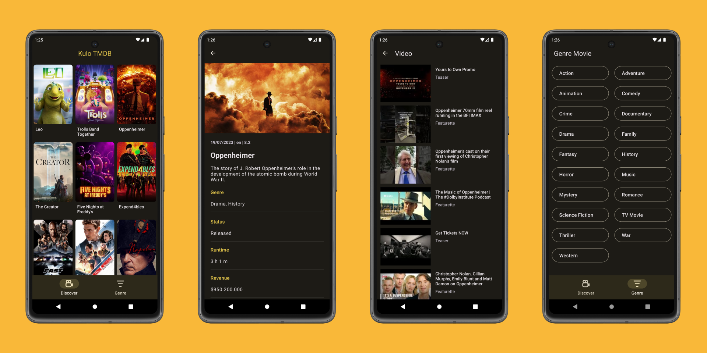

# Kulo TMDB - Movie app using The Movie Database API.

## Screenshots



This is a mobile application that allows users to stream movies using the API provided by [The Movie Database](https://www.themoviedb.org). The app provides various features to enhance the user experience and interact with movie data.

## User Stories

Below is a description of the user story and the functionality implemented in the application.

1. **Display Official Movie Genres**
   - Users can view a screen that shows a list of official movie genres.
   - Each genre can be selected to display movies associated with that genre.

2. **List Movies by Genre**
   - Users can navigate to a screen that displays a list of movies based on a selected genre.
   - The movie list is fetched using the API and presented in a visually appealing manner.

3. **View Movie Details**
   - When a user clicks on a movie from the list, the app shows the main information about that movie.
   - Details may include the movie title, release date, synopsis, and other relevant information.

4. **Display User Reviews for a Movie**
   - Users can access a section to read reviews left by other users for a specific movie.

5. **Show Movie Trailer from YouTube**
   - The app allows users to watch the official trailer of a movie from YouTube.
   - When viewing the movie details, a button is provided to play the trailer directly.

6. **Implement Endless Scrolling for Movie List and User Reviews**
   - The movie list and user reviews sections are implemented with endless scrolling.
   - As the user scrolls down, more movies and reviews are fetched and appended to the existing list.

7. **Handle Positive and Negative Edge Cases**
   - The application handles various scenarios gracefully, such as:
     - Handling API errors and displaying appropriate error messages to the user.

## Setup and Configuration

To set up the application locally, follow these steps:

1. Clone the repository from GitHub: `git clone https://github.com/WibiSa/Kulo_TMDB.git`.
2. Navigate to the project directory: `cd your-repository`.
3. Open the project in Android Studio.
4. Obtain an API key from [The Movie Database](https://www.themoviedb.org) by creating an account.
5. Create a local properties file in the project's root folder, if there is and add the following code:

   ```
   // local.properties

   tmdb_api_key='your-api-key'
   ```

   Replace `'your-api-key'` with the API key you obtained in the previous step.

6. Build the app.
7. Open the app in a mobile emulator or on your physical device.
